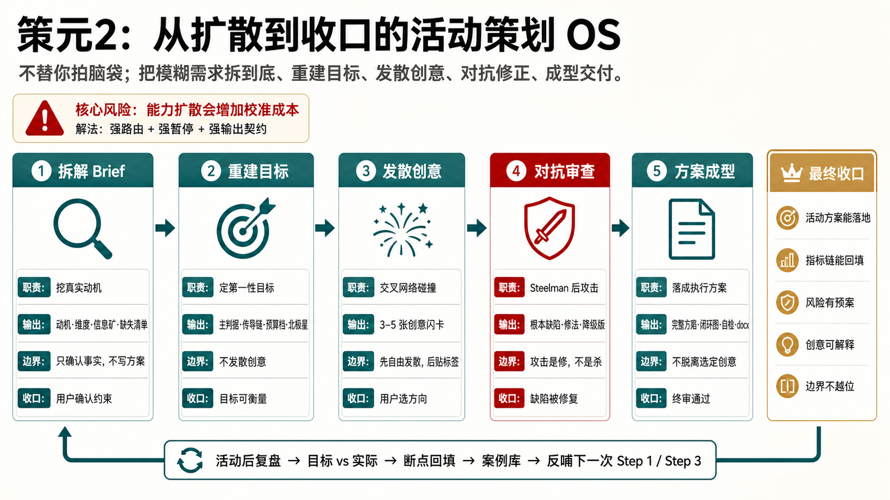
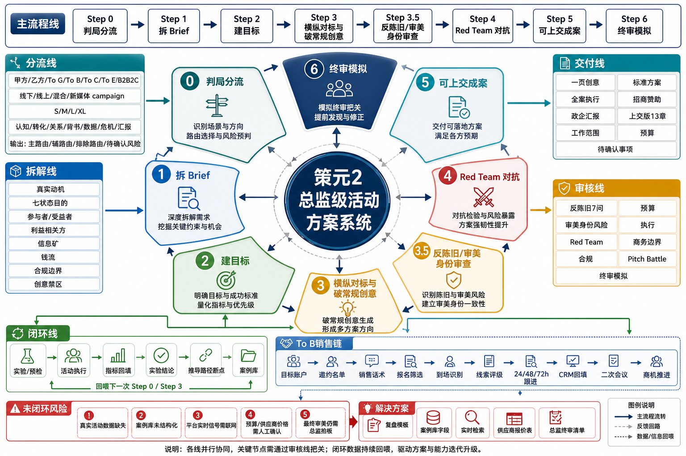

# 策元2 Ceyuan2

> 一个给活动策划用的 AI Skill。它不会一上来套模板，而是先帮你把需求问清楚，再一步步生成能落地、能解释、能被老板或客户质疑后仍站得住的活动方案。



## 先说人话：它到底是干什么的？

你可以把策元2理解成一个“活动策划总监陪练”。

普通 AI 经常这样做：

```text
你：帮我做一个发布会方案
AI：好的，以下是发布会流程：签到、领导致辞、产品介绍、互动抽奖、合影……
```

这类答案看起来完整，但经常没用。因为它没弄清楚几个关键问题：

- 这场活动到底是为了卖货、融资、招商、造势、维系关系，还是给内部汇报？
- 谁掏钱？谁拍板？谁到场？谁会反对？
- 活动成功到底看什么？到场人数、线索、订单、媒体曝光、领导满意，还是长期品牌资产？
- 创意只是换个主题包装，还是改变了用户行为？
- 方案被老板、客户、赞助商、政府、执行团队质疑时，能不能扛住？

策元2做的事，就是把这些问题提前拆开，然后再写方案。

## 适合谁用？

适合：

- 市场、品牌、公关、新媒体、运营、销售支持团队
- 需要写活动方案、发布会方案、招商会方案、年会方案、峰会论坛方案的人
- 乙方策划、广告公司、活动公司、咨询顾问
- 想把“有个想法”变成“能上交方案”的人

不太适合：

- 只想 10 秒钟拿一份通用模板的人
- 完全不愿意回答背景信息的人
- 已经确定只要照搬旧活动流程，不想重新判断目标的人

## 它能做哪些活动？

它不只做热闹的 To C 活动，也覆盖很多容易被模板忽略的场景。

| 类型 | 例子 | 它重点解决什么 |
|---|---|---|
| 品牌与传播 | 新品发布会、快闪、市集、品牌周年庆 | 怎么让活动有记忆点、传播点、可解释的创意机制 |
| 销售与招商 | 招商会、经销商大会、展会、品鉴会 | 怎么把活动接到线索、跟进、成交和 CRM 回填 |
| 内部活动 | 年会、团建、表彰会、内部文化活动 | 怎么避免流程化、尴尬化、只剩领导讲话 |
| 政企与仪式 | 开工仪式、揭牌仪式、政企推介会 | 怎么处理身份、秩序、合规、审美风险 |
| 内容型 campaign | 小红书/抖音/视频号活动、UGC 征集、线上线下联动 | 怎么把内容机制和活动机制连起来 |
| 高端私域 | 私享会、高端客户答谢、金融/医疗/艺术文化活动 | 怎么避免廉价感、冒犯感和身份错位 |

## 零基础 3 分钟上手

### 第一步：安装

方式一，使用 Git：

```bash
git clone https://github.com/DONGaOtang/ceyuan-2.git
```

方式二，直接下载：

打开仓库页面，点击 `Code`，选择 `Download ZIP`，解压。

然后把整个文件夹放到你的 Agent skills 目录里。

| 工具 | 推荐路径 |
|---|---|
| Codex | `~/.codex/skills/ceyuan-2/` |
| Claude Code | `~/.claude/skills/ceyuan-2/` |
| WorkBuddy | `~/.workbuddy/skills/ceyuan-2/` |
| 通用 Agents | `~/.agents/skills/ceyuan-2/` |

关键点只有两个：

- `SKILL.md` 必须在文件夹根目录。
- `references/` 文件夹必须一起保留，不要只复制 `SKILL.md`。

### 第二步：启动

你可以直接说：

```text
用策元2，帮我策划一场新品发布会
```

也可以更简单：

```text
帮我做一个公司年会方案
```

只要你的需求里有“活动、策划、方案、发布会、年会、招商会、快闪、峰会、campaign”等信号，它就应该被触发。

### 第三步：回答问题

它不会立刻甩给你一份 50 页方案，而是先问你一些问题。别怕，答不上就说“不知道”。

| 它会问 | 为什么必须问 | 你可以怎么答 |
|---|---|---|
| 为什么要办这场活动？ | 动机错了，方案全错。卖货和招商不是同一种活动。 | “主要想拿销售线索”“老板想做品牌声量”“其实是客户关系维护” |
| 谁付钱？预算多少？ | 预算决定方案体量，也决定哪些创意不能装。 | “预算还没定，先按 10 万以内想”“甲方出钱，但供应商要赞助” |
| 给谁看？谁拍板？ | 给老板、客户、政府、用户看的方案，写法完全不同。 | “先给老板过会”“要拿去竞标”“给内部执行团队用” |
| 有什么内部资源？ | 私域、会员、销售名单、老客户、场地资源，AI 搜不到。 | “有 3000 个会员”“销售有 200 个重点客户名单”“没有现成资源” |
| 有没有不能碰的东西？ | 合规、品牌禁区、审美风险，晚发现就返工。 | “不能太网红”“不能提价格战”“政府领导会到场” |

## 第一次怎么问？直接复制这些

如果你什么都没准备，用这个：

```text
用策元2帮我策划一场活动。
我现在只有一个模糊想法：{写你的活动想法}。
请先不要直接写完整方案，先问我必须补充的信息。
```

如果你要给老板看，用这个：

```text
用策元2做一份能给老板过会的活动方案。
活动类型：{发布会/年会/招商会/峰会/快闪等}
目标：{你认为的目标，不确定也可以写不确定}
预算：{大概预算}
时间地点：{已知信息}
请先判断这是什么局，再给我方案结构。
```

如果你是乙方，要提案或竞标，用这个：

```text
用策元2帮我做乙方提案。
客户背景：{客户是谁}
项目需求：{客户原话}
竞争情况：{是否比稿/竞标/已有供应商}
预算和交付：{已知信息}
请先拆解甲方真实动机、决策人关注点和提案风险。
```

如果你要做新媒体 campaign，用这个：

```text
用策元2策划一个线上线下联动 campaign。
品牌/产品：{是什么}
目标人群：{谁}
平台：{小红书/抖音/视频号/B站/私域等}
目标：{曝光/报名/线索/成交/UGC/品牌认知}
请先给我活动机制，不要只写内容选题。
```

## 它的工作流程

策元2不是“写方案机器”，而是一个从混乱到收口的流程。



简单说，它会走 7 个阶段：

| 阶段 | 它在做什么 | 你会看到什么 |
|---|---|---|
| Step 0 判局分流 | 先判断这是甲方自用、乙方提案、To C、To B、To G、内部活动还是 campaign | 分流判断表、主路由、风险预判 |
| Step 1 拆 Brief | 把模糊需求拆成真实动机、受众、资源、钱流、合规和创意禁区 | 需求字段表、缺失信息清单 |
| Step 2 建目标 | 把“办得好”改成可衡量目标 | 主判据、辅助指标、四层指标链 |
| Step 3 发散创意 | 用交叉网络生成多个不落俗套的方向 | 3 到 5 张创意闪卡 |
| Step 3.5 反陈旧审查 | 检查创意是不是只换皮、不换机制 | 陈旧风险、审美风险、身份错位风险 |
| Step 4 Red Team 对抗 | 先把创意说到最强，再攻击它 | 根本缺陷、修法、降级方案 |
| Step 5/6 成案与终审 | 写成能上交的方案，并模拟老板/客户打回 | 完整方案、预算、时间线、风险、终审意见 |

## 一个极简例子

输入：

```text
帮我策划一个 5 万预算的公司年会，100 人左右，不想太无聊。
```

普通模板可能会给：

```text
签到入场 -> 领导致辞 -> 节目表演 -> 抽奖 -> 晚宴 -> 合影
```

策元2会先拆：

| 问题 | 可能判断 |
|---|---|
| 这是不是“热闹”问题？ | 不一定。可能是员工疲惫、团队断层、优秀员工缺少被看见。 |
| 100 人、5 万预算意味着什么？ | 不适合大舞美，适合小机制、高参与、强记忆点。 |
| 成功怎么看？ | 到场率、参与率、员工内容产出、优秀员工被记住、活动后满意度。 |
| 创意不能只是什么？ | 不能只是换主题色、换口号、换主持词。 |

然后它可能给 3 个方向：

| 方向 | 核心概念 | 为什么不是普通年会 |
|---|---|---|
| 公司小史馆 | 每个团队贡献一个“今年最有代表性物件” | 把成果从 PPT 变成可触摸的共同记忆 |
| 反向颁奖礼 | 员工提名那些平时没人看见但真正救场的人 | 把表彰从领导视角改成同伴视角 |
| 明年预演局 | 每组用 5 分钟演出“明年最想发生的一件事” | 把年会从总结会改成共同想象 |

之后才进入对抗、预算、流程、物料、风险和执行排期。

## 最终会产出什么？

根据活动复杂度，它可能产出不同深度的交付件。

| 交付深度 | 适合场景 | 通常包含 |
|---|---|---|
| 一页创意 | 你只想先拿方向 | Big Idea、目标、核心机制、传播钩子 |
| 标准方案 | 常规活动、内部提案 | 背景、目标、创意、流程、传播、执行、预算、风险 |
| 全案执行版 | 大型活动、跨团队协作 | 分工表、物料表、倒排期、现场流程、供应商边界、应急预案 |
| 竞标/招商版 | 乙方提案、赞助提案 | 客户视角、商业价值、权益设计、报价边界、验收口径 |

正式方案通常会包含：

- 一句话 Big Idea
- 活动目标和成功标准
- 受众与参与路径
- 创意机制和现场体验
- 传播设计
- 实验或预检计划
- 执行时间线
- 人员分工
- 物料清单
- 预算表
- 风险预案
- 复盘指标
- 待确认事项

## 它和普通提示词有什么区别？

| 普通提示词 | 策元2 |
|---|---|
| 直接生成方案 | 先判局，再生成 |
| 容易套模板 | 有反陈旧审查 |
| 只问活动类型 | 会问钱流、资源、决策人、合规边界 |
| 创意靠灵感 | 用“锚点 × 热点/文化/情绪/跨界/感官/冲突”生成 |
| 方案看起来完整 | 会模拟质疑，把根本缺陷打出来 |
| 活动结束就结束 | 要求指标回填和案例库回流 |

## 文件结构

你不需要一开始读懂所有文件。零基础只要记住：

- `SKILL.md` 是入口，相当于总导演。
- `references/` 是工具箱，相当于不同专家的工作手册。
- README 是给人看的说明书，不参与实际运行。

```text
ceyuan-2/
├── README.md
├── SKILL.md
├── LICENSE
├── assets/
│   ├── ceyuan2-skill-scope-map.png
│   └── ceyuan2-skill-full-flow-mindmap.png
└── references/
    ├── triage-router.md
    ├── ai-role-prompts.md
    ├── creative-inputs.md
    ├── anti-stale-creative.md
    ├── experiment-validation.md
    ├── proposal-schema.md
    └── ...
```

常用参考模块：

| 文件 | 作用 |
|---|---|
| `triage-router.md` | 判断这是什么活动局 |
| `ai-role-prompts.md` | 让 AI 在不同阶段切换角色 |
| `creative-inputs.md` | 生成创意方向 |
| `anti-stale-creative.md` | 检查创意是不是陈旧模板 |
| `experiment-validation.md` | 设计 AB 测试或低成本预检 |
| `boardroom-proposal-schema.md` | 写能上交的正式方案 |
| `pitch-battle.md` | 乙方竞标、比稿、招商提案 |
| `metrics-flow.md` | 建立活动后的指标闭环 |

## 常见问题

### 我不会策划，可以用吗？

可以。它本来就是给“脑子里有一点想法，但不知道怎么拆、怎么写、怎么上交”的人用的。你只要能回答基本事实：活动给谁看、为什么办、大概多少钱、有什么限制。

### 我什么信息都没有怎么办？

直接说“不知道”。策元2会把未知项标出来，并先按最可能的情况做轻量版判断。它不会因为你答不上预算就停止工作。

### 它会不会问太多？

会问，但不是为了折磨你。活动方案最容易翻车的地方，基本都藏在前期问题里：动机、预算、决策人、资源、合规、审美边界。少问几句，后面可能返工几十页。

### 能不能让它一次性写完？

可以。你可以说：

```text
用策元2直接跑完整流程，中间不要暂停。信息不足的地方请标注假设。
```

但更推荐你至少在创意方向出来后选一次。否则它可能把一个你根本不喜欢的方向打磨得很完整。

### 它能导出 docx 吗？

取决于你使用的 Agent 环境是否有文档生成能力。策元2会优先尝试调用本地 docx/Word 相关能力；如果环境不支持，它会先给 Markdown 版方案。

### 需要联网吗？

不一定。普通内部活动可以不联网。涉及行业法规、城市报批、消防、广告法、竞品案例、近期热点时，应该联网核实，不能凭印象写。

## 关键词

活动策划、活动方案、发布会、年会、招商会、峰会论坛、快闪、市集、路演、品牌活动、新媒体 campaign、AI Skill、AI Agent、提示词工程、第一性原理、Red Team、对抗式审查、营销策划、创意陪练、指标闭环。

推荐 GitHub Topics：

```text
event-planning event-marketing marketing-campaign ai-agent ai-skill prompt-engineering red-team first-principles chinese
```

## License

MIT License. See `LICENSE`.
