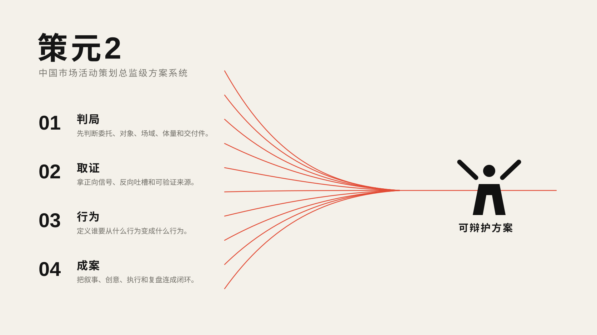
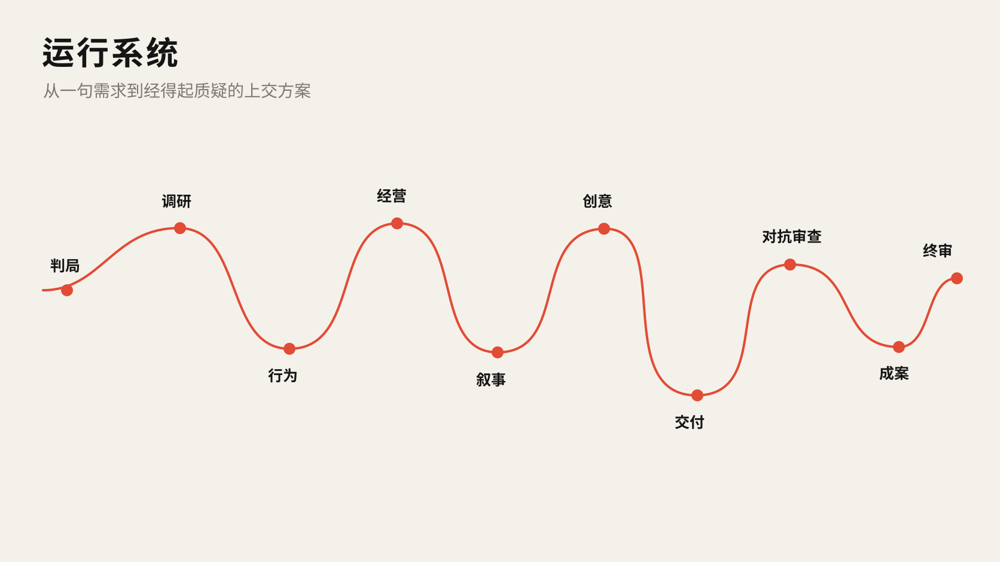
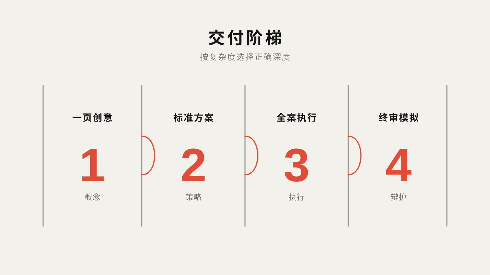
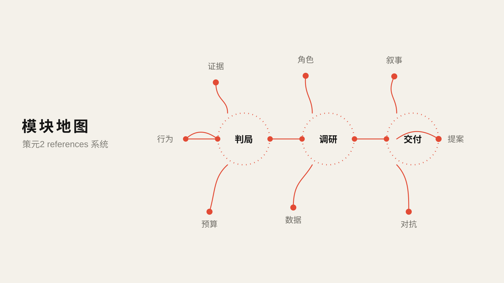
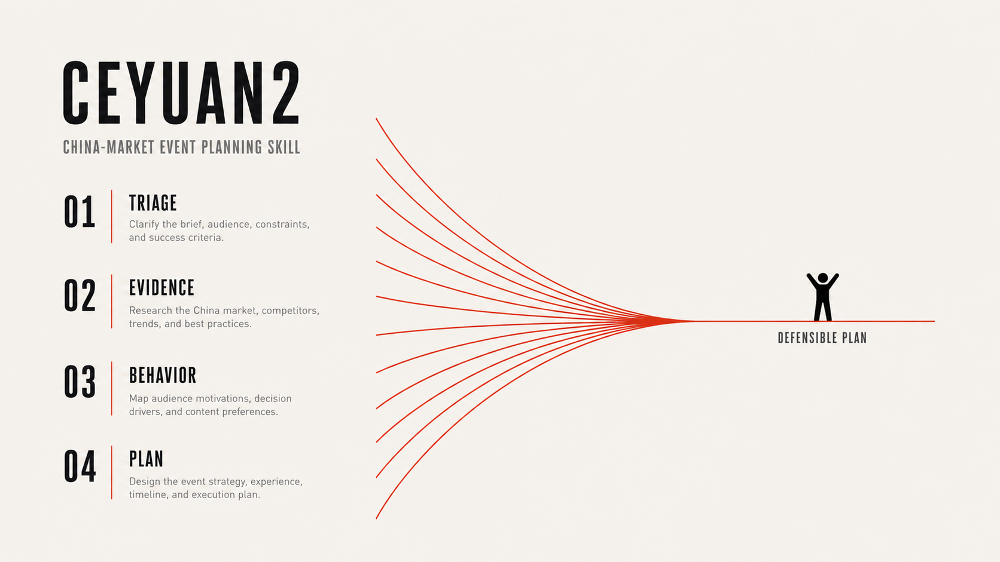
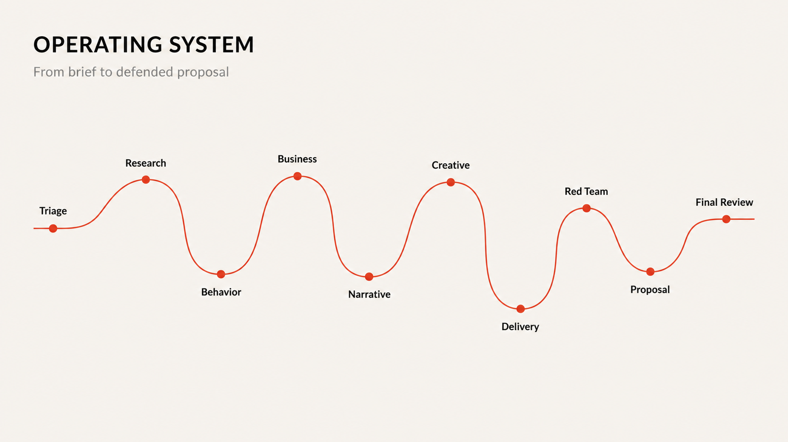
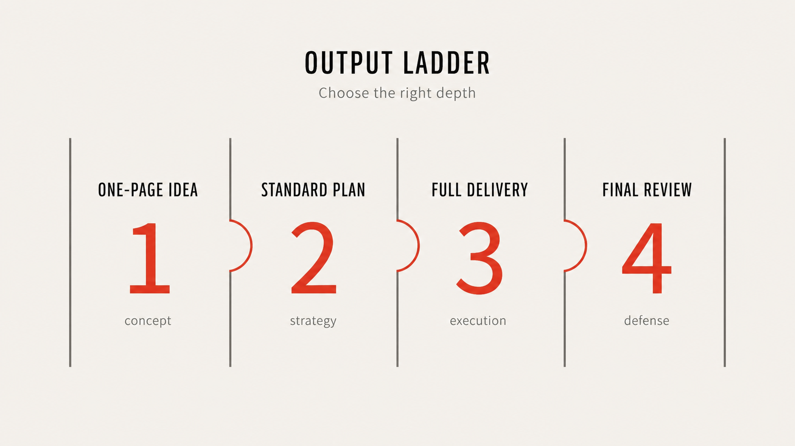
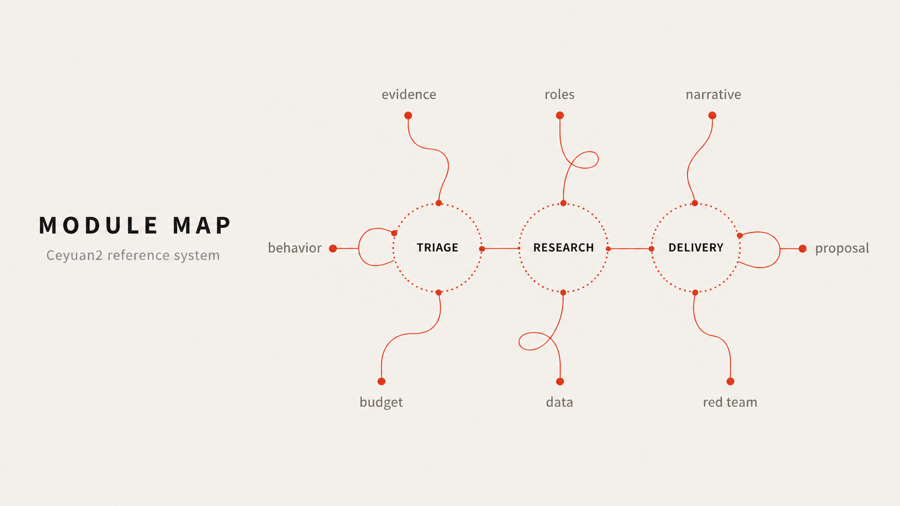

# 策元2 Ceyuan2

> 一个面向中国市场活动策划的 AI Skill。从真实需求出发，帮助完成概念与内容开发、活动方案、既有方案修订和复盘；按本次用途交付，并说明尚未确认的事实、资源和执行条件。
>
> An AI Skill for China-market event planning. It starts from the actual brief and helps develop concepts, content, event plans, revisions, and reviews. Deliverables follow the intended use, with unconfirmed facts, resources, and execution conditions stated explicitly.

**Language:** [中文](#先说人话它到底是干什么的) | [English](#english-version)



## 先说人话：它到底是干什么的？

你可以把策元2理解成一个“活动策划总监陪练”：既帮助从零策划，也能按范围审查已有方案或修订局部内容。

- **流程**：Step 0–9 依次完成判局、采集、行为改变、经营模型、叙事、创意、交付系统、对抗、成案和终审；默认在原有确认点暂停。
- **搜索**：先读用户材料，再按项目问题选择授权反馈、官方资料或平台案例；先验证访问能力，只引用实际取得的内容。路径见 [搜索模块](references/search-paths.md)。
- **交付**：先明确谁拿到后要审、改、算或执行，再选择最小文件组合与可编辑载体；只要一段或一个文件，就按该范围处理。
- **验收**：检查具体内容、前后串联和真实文件，并用成品完成一个约定动作；未确认资源或未完成检查不算已验证。

普通 AI 经常这样做：

```text
你：帮我做一个发布会方案
AI：好的，以下是发布会流程：签到、领导致辞、产品介绍、互动抽奖、合影……
```

这类答案看起来完整，但经常没用。因为它没弄清楚几个关键问题：

- 这场活动到底是为了卖货、融资、招商、造势、维系关系，还是给内部汇报？
- 谁掏钱？谁拍板？谁到场？谁会反对？
- 活动成功到底看什么？到场人数、线索、订单、媒体曝光、领导满意，还是长期品牌资产？
- 创意只是换个主题包装，还是改变了用户行为？
- 方案被老板、客户、赞助商、政府、执行团队质疑时，能不能扛住？

这些判断服务本次真实目标。观看、学习、理解和关系建立都可以是活动价值；销售、报名、赞助、公开传播等模块只在有对应任务时展开。

## 适合谁用？

适合：

- 市场、品牌、公关、新媒体、运营、销售支持团队
- 需要写活动方案、发布会方案、招商会方案、年会方案、峰会论坛方案的人
- 乙方策划、广告公司、活动公司、咨询顾问
- 想把“有个想法”变成“能上交方案”的人

不太适合：

- 只想 10 秒钟拿一份通用模板的人
- 完全不愿意回答背景信息的人
- 已经确定只要照搬旧活动流程，不想重新判断目标的人

## 它能做哪些活动？

它不只做热闹的 To C 活动，也覆盖很多容易被模板忽略的场景。

| 类型 | 例子 | 它重点解决什么 |
|---|---|---|
| 品牌与传播 | 新品发布会、快闪、市集、品牌周年庆 | 怎么让活动有记忆点、传播点、可解释的创意机制 |
| 销售与招商 | 招商会、经销商大会、展会、品鉴会 | 怎么把活动接到线索、跟进、成交和 CRM 回填 |
| 内部活动 | 年会、团建、表彰会、内部文化活动 | 怎么避免流程化、尴尬化、只剩领导讲话 |
| 文化与专业交流 | 读剧会、阅读活动、闭门技术研讨 | 怎么写出完整内容、人物关系或问题讨论，不强加销售与公开传播 |
| 政企与仪式 | 开工仪式、揭牌仪式、政企推介会 | 怎么处理身份、秩序、合规、审美风险 |
| 内容型 campaign | 小红书/抖音/视频号活动、UGC 征集、线上线下联动 | 怎么把内容机制和活动机制连起来 |
| 高端私域 | 私享会、高端客户答谢、金融/医疗/艺术文化活动 | 怎么避免廉价感、冒犯感和身份错位 |

## 零基础 3 分钟上手

### 第一步：安装

方式一，使用 Git：

```bash
git clone https://github.com/DONGaOtang/ceyuan-2.git
```

方式二，直接下载：

打开仓库页面，点击 `Code`，选择 `Download ZIP`，解压。

然后把整个文件夹放到你的 Agent skills 目录里。

| 工具 | 推荐路径 |
|---|---|
| Codex | `~/.codex/skills/ceyuan-2/` |
| Claude Code | `~/.claude/skills/ceyuan-2/` |
| WorkBuddy | `~/.workbuddy/skills/ceyuan-2/` |
| 通用 Agents | `~/.agents/skills/ceyuan-2/` |

关键点只有两个：

- `SKILL.md` 必须在文件夹根目录。
- `references/` 文件夹必须一起保留，不要只复制 `SKILL.md`。

### 第二步：启动

你可以直接说：

```text
用策元2，帮我策划一场新品发布会
```

也可以更简单：

```text
帮我做一个公司年会方案
```

只要你的需求里有“活动策划、活动方案、发布会、年会、招商会、快闪、峰会、campaign、直播活动、仪式活动、文旅节庆”等活动组合信号，它就应该被触发。单独出现“方案”不构成触发，必须能判断为活动、营销 campaign、会议会务、仪式、展会、节庆、赞助或线上/线下参与机制相关需求。

### 第三步：回答问题

它不会立刻甩给你一份 50 页方案，而是先问你一些问题。别怕，答不上就说“不知道”。

| 它会问 | 为什么必须问 | 你可以怎么答 |
|---|---|---|
| 为什么要办这场活动？ | 动机错了，方案全错。卖货和招商不是同一种活动。 | “主要想拿销售线索”“老板想做品牌声量”“其实是客户关系维护” |
| 谁付钱？预算多少？ | 预算决定方案体量，也决定哪些创意不能装。 | “预算还没定，先按 10 万以内想”“甲方出钱，但供应商要赞助” |
| 给谁看？谁拍板？ | 给老板、客户、政府、用户看的方案，写法完全不同。 | “先给老板过会”“要拿去竞标”“给内部执行团队用” |
| 有什么内部资源？ | 私域、会员、销售名单、老客户、场地资源，AI 搜不到。 | “有 3000 个会员”“销售有 200 个重点客户名单”“没有现成资源” |
| 有没有不能碰的东西？ | 合规、品牌禁区、审美风险，晚发现就返工。 | “不能太网红”“不能提价格战”“政府领导会到场” |

## 第一次怎么问？直接复制这些

如果你什么都没准备，用这个：

```text
用策元2帮我策划一场活动。
我现在只有一个模糊想法：{写你的活动想法}。
请先不要直接写完整方案，先问我必须补充的信息。
```

如果你要给老板看，用这个：

```text
用策元2做一份能给老板过会的活动方案。
活动类型：{发布会/年会/招商会/峰会/快闪等}
目标：{你认为的目标，不确定也可以写不确定}
预算：{大概预算}
时间地点：{已知信息}
请先判断这是什么局，再给我方案结构。
```

如果你是乙方，要提案或竞标，用这个：

```text
用策元2帮我做乙方提案。
客户背景：{客户是谁}
项目需求：{客户原话}
竞争情况：{是否比稿/竞标/已有供应商}
预算和交付：{已知信息}
请先拆解甲方真实动机、决策人关注点和提案风险。
```

如果你要做新媒体 campaign，用这个：

```text
用策元2策划一个线上线下联动 campaign。
品牌/产品：{是什么}
目标人群：{谁}
平台：{小红书/抖音/视频号/B站/私域等}
目标：{曝光/报名/线索/成交/UGC/品牌认知}
请先给我活动机制，不要只写内容选题。
```

## 它的工作流程

策元2不是“写方案机器”，而是一个从混乱到收口的流程。



简单说，它会走 10 个阶段。默认分步运行，每到硬暂停点都会等你确认；只有你明确说“允许跳过所有暂停点、按假设完整输出、接受未经确认风险”，它才会连续跑完。

| 阶段 | 它在做什么 | 你会看到什么 |
|---|---|---|
| Step 0 判局分流 | 先判断这是甲方自用、乙方提案、To C、To B、To G、内部活动还是 campaign | 主路由、辅路由、排除路由、关键缺口 |
| Step 1 信息采集与横纵分析 | 先读已有材料并检查来源访问能力，收集与项目有关的正反信号 | 关键依据、正向机会、反向警告、待验证项及来源限制 |
| Step 2 行为改变 | 把“目标人群”拆成谁要改变什么行为 | 真实动机、3 类以内关键角色、最大阻力 |
| Step 3 经营模型 | 把“办得好”改成可证明、可采集、可取舍的目标 | 业务目标、主判据、关键预算/数据/降级结论 |
| Step 4 中国市场叙事 | 找到老板、客户、媒体和用户能复述的故事主线 | 主叙事、核心冲突、主场面、关键表达 |
| Step 5 创意机制 | 用交叉网络生成多个不落俗套的方向 | 2 到 3 张压缩创意卡，等待你选择 |
| Step 6 交付系统 | 按本次用途核对内容、资源与接手条件；执行任务落实排产与降级 | 最小交付安排、责任摘要、最大卡点及适用的执行表 |
| Step 7 Red Team 对抗 | 攻击当前阶段内容与策略风险；最终文件按约定到期阶段检查 | 最高风险、修法、失败降级 |
| Step 8 成案 | 按确认用途完成客户文件，另存内部决策与审查记录 | 本次约定的客户文件，不自动附送内部记录 |
| Step 9 终审模拟 | 按实际读者审查，并在真实成品上测试约定的代表动作 | 判词、必改项、实测结果和未检项 |

## 一个极简例子

输入：

```text
帮我策划一个 5 万预算的公司年会，100 人左右，不想太无聊。
```

普通模板可能会给：

```text
签到入场 -> 领导致辞 -> 节目表演 -> 抽奖 -> 晚宴 -> 合影
```

策元2会先拆：

| 问题 | 可能判断 |
|---|---|
| 这是不是“热闹”问题？ | 不一定。可能是员工疲惫、团队断层、优秀员工缺少被看见。 |
| 100 人、5 万预算意味着什么？ | 不适合大舞美，适合小机制、高参与、强记忆点。 |
| 成功怎么看？ | 到场率、参与率、员工内容产出、优秀员工被记住、活动后满意度。 |
| 创意不能只是什么？ | 不能只是换主题色、换口号、换主持词。 |

然后它可能给 3 个方向：

| 方向 | 核心概念 | 为什么不是普通年会 |
|---|---|---|
| 公司小史馆 | 每个团队贡献一个“今年最有代表性物件” | 把成果从 PPT 变成可触摸的共同记忆 |
| 反向颁奖礼 | 员工提名那些平时没人看见但真正救场的人 | 把表彰从领导视角改成同伴视角 |
| 明年预演局 | 每组用 5 分钟演出“明年最想发生的一件事” | 把年会从总结会改成共同想象 |

选定方向后，再深化预算、流程、物料和执行安排，经过对抗审查、成案与终审。

本流程保持十个阶段、原有角色和确认动作。每个阶段沿用真实需求记录，逐项核对行业适配、具体内容、关系串联、可用资源和最终文件；阶段摘要短，不代表交付正文只能写几句。行业表是校准起点，未知行业须补专业资料与适用标准，不能只换行业名称。

每轮先核对已有续接记录，再按需读回实际正文；有实质产出就保存并更新阶段、确认状态、文件位置和下一步。上下文压力有可信数据才报告，没有则记未知；续接不能改变模型窗口大小、强制压缩或代替用户确认。

## 最终会产出什么？

交付深度由本次用途、内容成熟度和实际接手动作决定，活动复杂度帮助确定颗粒度。下表是候选，不是每次必交清单。



| 交付深度 | 适合场景 | 通常包含 |
|---|---|---|
| 一页创意 | 你只想先拿方向 | Big Idea、目标、核心机制、传播钩子 |
| 标准方案 | 常规活动、内部提案 | 背景、核心问题、目标、创意机制、流程、传播、执行、预算、风险、验收 |
| 全案执行版 | 大型活动、跨团队协作 | 分工表、物料表、倒排期、现场流程、供应商边界、应急预案 |
| 竞标/招商版 | 乙方提案、赞助提案 | 客户视角、商业价值、权益设计、报价边界、验收口径 |

Step8保留活动方案与内部过程记录的内容分层，客户实际接收的文件按用途和已确认范围确定；强叙事文化节庆、艺术展演或明确要求独立概念案时提供相应概念内容。用户只要概念案或单文件时按指定范围交付，内部记录不自动追加为客户附件。

| 文件 | 给谁看 | 内容 |
|---|---|---|
| 概念案（条件触发） | 客户、主创、设计与内容评审 | 完整活动介绍、故事与单元内容、观众旅程、系列关系、视觉及参考 |
| 活动方案 | 老板、客户、市场部、执行负责人 | 干净正文：业务问题、目标、创意、执行、预算、风险、验收 |
| 思考过程 | 策划者、复盘者、二次修改者 | 一页决策摘要、关键决策记录、风险与验证地图、可下钻附录 |

概念案必须让人读懂整场体验：每个主要单元写清发生什么、观众看见或做什么、如何完成、为什么接下一段。配图和参考案例服务理解；没有图片时可用文字分镜辅助说明，但不能抵交已约定的实际图片或视觉成稿，也不能用漂亮图或时长表掩盖内容空缺。详见 [叙事与概念案交付](references/narrative-and-concept-delivery.md)。

用户点名的文件、格式与用途优先于默认清单。概念案、执行案、传播稿、脚本、预算表等分别按实际成熟度验收；有目录、标题或文件名不等于已交付。只在本项目需要时生成相应文件，并检查内容、可编辑性/可打开性、链接及跨文件口径；不能承诺一份模板天然覆盖所有行业和所有标准。

维护本技能时，每条修改都要追踪到入口、角色、引用模块、模板、输出和验收中的受影响位置，并记录实际改动或无需改动的理由；用跨步骤场景和反例验证联动。更新一处说明、保留冲突的旧例子，或仅证明文件副本相同，都不能算修改已全局生效。

执行类正式方案通常会包含以下适用内容；概念案不强塞执行大表，传播等模块按实际任务选取：

- 一句话 Big Idea
- 活动目标和成功标准
- 受众与参与路径
- 创意机制和现场体验
- 传播设计
- 执行时间线
- 人员分工
- 物料清单
- 预算表
- 风险预案
- 验收指标
- 待确认事项

事实假设、证据来源、完整推导、Red Team、实验计划和复盘回填模板默认进入“思考过程”，不塞进正式方案正文。

## 它和普通提示词有什么区别？

| 普通提示词 | 策元2 |
|---|---|
| 直接生成方案 | 先判局，再生成 |
| 容易套模板 | 有反陈旧审查 |
| 只问活动类型 | 会问钱流、资源、决策人、合规边界、数据采集和交付边界 |
| 创意靠灵感 | 先定义行为改变和经营判据，再用“锚点 × 热点/文化/情绪/跨界/感官/冲突”生成 |
| 方案看起来完整 | 会同时攻击策略风险和交付矛盾 |
| 活动结束就结束 | 要求指标回填、数据采集和 `output/` 案例库回流 |

## 模块地图

策元2现在有多个 `references/` 模块。你不需要全读，它会按 Step 和场景触发：判局用判局模块，预算用经营模块，文旅强叙事先过边界模块，赞助招商用赞助履约模块，信息采集会先走来源访问与登录工作流。



## 文件结构

你不需要一开始读懂所有文件。零基础只要记住：

- `SKILL.md` 是入口，相当于总导演。
- `references/` 是工具箱，相当于不同专家的工作手册。
- `output/` 是沉淀区，案例、跑测、用户项目稿和改进建议先写这里。
- README 是给人看的说明书，不参与实际运行。

```text
ceyuan-2/
├── README.md
├── SKILL.md
├── LICENSE
├── assets/
│   ├── ceyuan2-what-it-does-zh.svg
│   ├── ceyuan2-os-map-zh.svg
│   ├── ceyuan2-output-ladder-zh.svg
│   ├── ceyuan2-module-map-zh.svg
│   ├── ceyuan2-what-it-does.png
│   ├── ceyuan2-os-map.png
│   ├── ceyuan2-output-ladder.png
│   └── ceyuan2-module-map.png
├── output/
│   ├── case-library/
│   ├── run-reviews/
│   ├── user-projects/
│   └── improvement-log/
└── references/
    ├── triage-router.md
    ├── anti-hallucination-and-evidence.md
    ├── stakeholder-behavior-change.md
    ├── business-model-and-budget.md
    ├── china-market-narrative.md
    ├── critical-path-delivery.md
    ├── ai-role-prompts.md
    ├── role-overlays-by-scenario.md
    ├── source-access-and-login-workflow.md
    ├── culture-tourism-boundary.md
    ├── creative-inputs.md
    ├── anti-stale-creative.md
    ├── experiment-validation.md
    ├── proposal-schema.md
    └── ...
```

常用参考模块：

| 文件 | 作用 |
|---|---|
| `triage-router.md` | 判断这是什么活动局 |
| `anti-hallucination-and-evidence.md` | 管事实分级、来源绑定和防编造 |
| `ai-role-prompts.md` | 让 AI 在不同阶段切换角色 |
| `role-overlays-by-scenario.md` | 按乙方竞标、政企、To B、文旅、年会、发布会等场景叠加角色判断 |
| `search-paths.md` | 按项目疑问选择来源，核对信息与对标范围 |
| `source-access-and-login-workflow.md` | 管联网、浏览器、登录、权限、验证码、降级和采集状态 |
| `culture-tourism-boundary.md` | 管文旅强叙事示例的加载边界，防止污染普通活动 |
| `stakeholder-behavior-change.md` | 把目标人群拆成具体行为改变 |
| `business-model-and-budget.md` | 处理预算、成本、回报和降级模型 |
| `china-market-narrative.md` | 建中国市场可复述的主叙事 |
| `narrative-and-concept-delivery.md` | 写完整概念、内容单元与前后串联，并按用途验收 |
| `creative-inputs.md` | 生成创意方向 |
| `anti-stale-creative.md` | 检查创意是不是陈旧模板 |
| `critical-path-delivery.md` | 把方案压成关键路径、RACI 和交付节点 |
| `registration-and-attendance.md` | 处理报名、邀约、到场和 no-show |
| `sponsorship-fulfillment.md` | 处理赞助权益、履约和 ROI 回报 |
| `data-capture-and-review.md` | 处理数据采集、复盘和证据沉淀 |
| `experiment-validation.md` | 设计 AB 测试或低成本预检 |
| `boardroom-proposal-schema.md` | 写能上交的正式方案 |
| `activity-word-template-and-adaptation.md` | 处理 Word 输出模板、4A 产出逻辑、思考范围和不同活动适配 |
| `pitch-winning-proposal.md` | 强化老板过会、竞标、中标力和年度事件叙事 |
| `pitch-battle.md` | 乙方竞标、比稿、招商提案 |
| `metrics-flow.md` | 建立活动后的指标闭环 |

## 常见问题

### 我不会策划，可以用吗？

可以。它本来就是给“脑子里有一点想法，但不知道怎么拆、怎么写、怎么上交”的人用的。你只要能回答基本事实：活动给谁看、为什么办、大概多少钱、有什么限制。

### 我什么信息都没有怎么办？

直接说“不知道”。策元2先标记未知并做临时分流。Step 0 的十项关键输入中有任意 3 项以上缺失时，会提出最多 5 个优先问题并暂停；未触发该门槛时可按规则继续，但不能把假设写成已确认事实。

### 它会不会问太多？

会问，但不是为了折磨你。活动方案最容易翻车的地方，基本都藏在前期问题里：动机、预算、决策人、资源、合规、审美边界。少问几句，后面可能返工几十页。

### 能不能让它一次性写完？

可以。你可以说：

```text
用策元2直接跑完整流程；允许跳过所有暂停点，允许基于假设生成，接受未经确认风险。信息不足的地方请标注假设。
```

但更推荐你至少在创意方向出来后选一次。否则它可能把一个你根本不喜欢的方向打磨得很完整。

### 它能导出 docx 吗？

取决于 Agent 环境的生成与检查能力。需要 Word 时，它会先检查可用工具，再生成和检查真实 DOCX；若做不到，会明确说明“未生成 docx”，保留可编辑内容源稿，不能把 Markdown 当作已完成的 Word 交付。PPTX、工作簿和其他载体同样按本次用途、工具能力和实际检查结果处理。

### 需要联网吗？

不一定。普通内部活动可以不联网。涉及行业法规、城市报批、消防、广告法、竞品案例、近期热点时，应该联网核实，不能凭印象写。

对于小红书、抖音、微博、B站、知乎评论区或付费数据平台，策元2不应默认都能自动采集。它会先检测访问状态；如果需要登录、验证码或账号权限，只列本次最小必要清单让你选择。你不登录时，它会降级到公开网页、搜索引擎 `site:`、官方/媒体/报告源，并标注证据限制。

对标资料分别记录正文已读范围、视觉已看页/帧和原生编辑性是否核验。看到封面不等于读完方案，读取文字不等于看过版式，看到 PDF 不等于取得可编辑源文件。

## 关键词

活动策划、活动方案、发布会、年会、招商会、峰会论坛、快闪、市集、路演、品牌活动、新媒体 campaign、AI Skill、AI Agent、提示词工程、第一性原理、Red Team、对抗式审查、营销策划、创意陪练、指标闭环。

推荐 GitHub Topics：

```text
event-planning event-marketing marketing-campaign ai-agent ai-skill prompt-engineering red-team first-principles chinese
```

## License

MIT License. See `LICENSE`.

---

# English Version

> Ceyuan2 is an AI Skill for China-market event planning. Think of it as a senior event-planning sparring partner: it helps you triage the brief, gather evidence, define behavior change, build the business model and narrative, attack weak assumptions, and turn the result into a plan people can actually use.



## What Is Ceyuan2?

Ceyuan2 acts as an event-planning sparring partner. It supports new projects, reviews of existing plans, and revisions limited to the requested scope.

- **Workflow:** Steps 0–9 cover triage, research, behavior change, business modeling, narrative, creative mechanisms, delivery design, red-team review, final drafting, and final review. The existing confirmation checkpoints apply by default.
- **Research:** Read the supplied material first, then choose authorized feedback, official sources, or platform cases that answer the project's questions. Check access and use only content actually obtained. See [search paths](references/search-paths.md).
- **Deliverables:** Identify what the recipient needs to review, edit, calculate, or execute, then choose the smallest sufficient file set and editable format. A request for one passage or one file stays within that scope.
- **Acceptance:** Check substantive content, connections between units, and actual files; perform a representative task on the artifact. Unconfirmed resources and unperformed checks remain unverified.

Most AI event-planning answers look complete but are shallow:

```text
You: Help me plan a product launch.
AI: Sure. Here is the agenda: registration, opening speech, product demo, lucky draw, group photo...
```

That is not a strategy. It is a recycled schedule.

Ceyuan2 starts earlier. Before writing the plan, it asks the questions that decide whether the plan will work:

- Is this event for sales, fundraising, channel recruitment, brand awareness, relationship management, internal reporting, or public credibility?
- Who pays, who approves, who attends, and who may object?
- What does success mean: attendance, leads, orders, media exposure, executive approval, or long-term brand assets?
- Is the idea actually changing participant behavior, or just repainting an old format?
- Can the plan survive questions from the boss, client, sponsor, government stakeholder, or execution team?

These decisions serve the actual goal. Watching, learning, understanding, and building relationships can all be valid outcomes. Sales, registration, sponsorship, and public communication apply only when the project calls for them.

## Who Is It For?

Ceyuan2 is useful for:

- Marketing, brand, PR, social media, operations, and sales enablement teams
- People writing event proposals, product launches, annual galas, dealer conferences, summits, and campaign plans
- Agencies, event companies, consultants, and proposal teams
- Anyone trying to turn “we have an idea” into “we can submit this plan”

It is not ideal for:

- People who only want a generic template in 10 seconds
- Users unwilling to provide any background information
- Teams that already know they only want to repeat last year's event

## What Kinds of Events Can It Handle?

Ceyuan2 is not limited to flashy consumer events. It also covers B2B, internal, government-facing, and content-led campaigns.

| Type | Examples | What Ceyuan2 Focuses On |
|---|---|---|
| Brand and communication | Product launches, pop-ups, markets, brand anniversaries | Memory points, shareability, and explainable creative mechanisms |
| Sales and channel growth | Dealer conferences, exhibitions, tastings,招商-style events | Lead capture, follow-up, conversion, and CRM feedback |
| Internal events | Annual galas, team building, recognition ceremonies | Avoiding empty speeches, awkward performances, and generic awards |
| Cultural and professional exchange | Play readings, reading activities, closed technical discussions | Developing complete content, character relationships, or substantive discussion without imposing sales or public promotion |
| Government and ceremonial events | Groundbreaking, unveiling, public-private roadshows | Identity, order, compliance, tone, and aesthetic risk |
| Content-led campaigns | RedNote/Xiaohongshu, Douyin/TikTok-style campaigns, UGC, O2O activations | Connecting content mechanics with event mechanics |
| Premium private events | Private salons, VIP appreciation, finance/medical/art events | Avoiding cheapness, overexposure, and status mismatch |

## 3-Minute Beginner Setup

### Step 1: Install

Option 1, use Git:

```bash
git clone https://github.com/DONGaOtang/ceyuan-2.git
```

Option 2, download manually:

Open the repository page, click `Code`, choose `Download ZIP`, then unzip it.

Move the whole folder into your agent's skills directory.

| Tool | Recommended Path |
|---|---|
| Codex | `~/.codex/skills/ceyuan-2/` |
| Claude Code | `~/.claude/skills/ceyuan-2/` |
| WorkBuddy | `~/.workbuddy/skills/ceyuan-2/` |
| Generic Agents | `~/.agents/skills/ceyuan-2/` |

Two things matter:

- `SKILL.md` must stay at the root of the folder.
- Keep the `references/` folder. Do not copy only `SKILL.md`.

### Step 2: Start It

You can say:

```text
Use Ceyuan2 to help me plan a product launch.
```

Or simply:

```text
Help me create an annual company event plan.
```

If your request includes signals like event, event plan, campaign, launch, annual gala, dealer conference, pop-up, summit, or activation, the skill should be triggered.

### Step 3: Answer Its Questions

Ceyuan2 will not immediately dump a 50-page plan. It will ask a few questions first. If you do not know the answer, say “I don't know.”

| It Asks | Why It Matters | Example Answer |
|---|---|---|
| Why are you holding this event? | If the motive is wrong, the whole plan is wrong. Selling and channel recruitment are different events. | “We mainly need sales leads.” “The boss wants brand visibility.” “This is really client relationship maintenance.” |
| Who pays, and what is the budget? | Budget decides the scale and filters out fake creativity. | “Budget is not fixed. Think under 100k RMB first.” “The client pays, but sponsors may cover part of it.” |
| Who will read or approve the plan? | A plan for a boss, a client, a government stakeholder, or an execution team is written differently. | “For internal approval first.” “For a competitive agency pitch.” “For the execution team.” |
| What resources do you already have? | Private traffic, member lists, sales leads, venues, and previous data cannot be guessed by AI. | “We have 3,000 members.” “Sales has 200 key accounts.” “No existing resources.” |
| What must not be touched? | Compliance, brand taboos, and tone risks are expensive to discover late. | “Cannot look too internet-celebrity.” “Do not mention price war.” “Government leaders will attend.” |

## First Prompts You Can Copy

If you have almost nothing prepared:

```text
Use Ceyuan2 to help me plan an event.
I only have a vague idea: {describe your idea}.
Do not write the full plan yet. First ask me the essential questions.
```

If the plan is for your boss:

```text
Use Ceyuan2 to create an event proposal for executive approval.
Event type: {launch / annual gala / dealer conference / summit / pop-up}
Goal: {your best guess, even if uncertain}
Budget: {rough budget}
Time and location: {known information}
First judge what kind of strategic situation this is, then give me the proposal structure.
```

If you are an agency or vendor preparing a pitch:

```text
Use Ceyuan2 to help me build an agency proposal.
Client background: {who the client is}
Client brief: {their original request}
Competition: {pitch / incumbent vendor / open tender / unknown}
Budget and deliverables: {known information}
First identify the client's real motive, decision-maker concerns, and pitch risks.
```

If you are building a social/content campaign:

```text
Use Ceyuan2 to plan an online-offline campaign.
Brand/product: {what it is}
Audience: {who}
Platforms: {RedNote/Xiaohongshu, Douyin/TikTok, WeChat Channels, Bilibili, private traffic, etc.}
Goal: {awareness / sign-ups / leads / sales / UGC / brand recognition}
Start with the participation mechanism, not just content topics.
```

## Workflow

Ceyuan2 is not a “write me a plan” machine. It is a process that moves from messy input to a submit-ready output.



In plain terms, it works in 10 stages. By default, it runs step by step and stops at each hard checkpoint for confirmation. It only runs continuously when you explicitly allow skipping all checkpoints, generating from assumptions, and accepting unconfirmed-risk tradeoffs.

| Stage | What It Does | What You See |
|---|---|---|
| Step 0 Triage | Determines whether this is client-side, agency-side, To C, To B, To G, internal, or campaign work | Main route, supporting routes, excluded routes, key gaps |
| Step 1 Research and Signal Analysis | Reads existing material, checks source access, and gathers relevant positive and negative signals | Key evidence, opportunities, warnings, unverified items, source limits |
| Step 2 Behavior Change | Turns “target audience” into who must change which observable behavior | Actual motive, up to 3 key stakeholder groups, main resistance |
| Step 3 Business Model | Turns “make it good” into measurable, collectable, and tradeoff-ready goals | Goal, primary criterion, key budget/data/fallback conclusions |
| Step 4 China-Market Narrative | Builds a story the relevant readers can repeat | Main narrative, core conflict, defining scene, key expression |
| Step 5 Creative Mechanism | Uses a cross-network method to generate non-template directions | 2 to 3 concise idea cards for selection |
| Step 6 Delivery System | Checks content, resources, and handoff conditions for the intended use; execution work includes scheduling and fallbacks | Minimum delivery arrangement, responsibilities, key blockers, applicable execution tables |
| Step 7 Red Team | Attacks current-stage content and strategy risks; final files are checked when due | Highest risks, repairs, fallback versions |
| Step 8 Final Plan | Produces the agreed client files and separately saves internal decision and review records | Agreed client files; internal records are not automatic attachments |
| Step 9 Final Review | Reviews for the actual reader and tests a representative task on the real artifact | Verdict, required fixes, test results, unchecked items |

## A Tiny Example

Input:

```text
Help me plan a company annual gala for about 100 people with a 50k RMB budget. We don't want it to be boring.
```

A generic template may produce:

```text
Registration -> leader speech -> performances -> lucky draw -> dinner -> group photo
```

Ceyuan2 first asks what is really going on:

| Question | Possible Judgment |
|---|---|
| Is this really a “make it lively” problem? | Not necessarily. It may be about fatigue, team fragmentation, or invisible contributors. |
| What does 100 people and 50k RMB imply? | Big stage production is unlikely. Small mechanisms, high participation, and strong memory points are better. |
| What counts as success? | Attendance, participation, employee-generated content, recognition recall, post-event satisfaction. |
| What must the idea avoid? | It cannot just change the theme color, slogan, or host script. |

Then it may propose directions like:

| Direction | Core Concept | Why It Is Not a Generic Gala |
|---|---|---|
| Company Mini-Museum | Each team contributes one object that represents the year | Turns achievements from slides into shared memory |
| Reverse Awards | Employees nominate people who quietly saved important work | Moves recognition from leadership-only judgment to peer recognition |
| Next-Year Rehearsal | Each team performs one thing they want to make true next year | Turns the gala from a recap into collective imagination |

After a direction is chosen, the budget, schedule, materials, and execution arrangements are developed further, followed by red-team review, final drafting, and final review.

The ten stages, existing roles, and confirmation points remain in place. Each stage carries the actual brief forward and checks industry fit, substantive content, connections between units, available resources, and final files. Concise stage summaries do not limit the depth of the deliverable. Industry references are starting points; unfamiliar domains require relevant evidence and applicable standards.

Each turn begins by checking the existing continuation record and reading the relevant actual content. Substantive work is saved with its stage, confirmation status, file location, and next action. Context pressure is reported only when reliable telemetry exists; otherwise it is unknown. Continuation records cannot enlarge the model window, force compaction, or replace user confirmation.

## What Will It Produce?

Output depth follows the intended use, content maturity, and recipient's actual task; event complexity helps set the level of detail. The table lists candidates, not a mandatory bundle.



| Output Depth | Best For | Usually Includes |
|---|---|---|
| One-page idea | You only need a direction first | Big Idea, goal, core mechanism, communication hook |
| Standard proposal | Normal events and internal proposals | Background, goal, idea, flow, communication, execution, budget, risks |
| Full execution plan | Large events and cross-team delivery | Responsibility table, materials list, reverse timeline, onsite schedule, vendor boundaries, emergency plans |
| Pitch or sponsorship version | Agency pitch, tender, sponsorship proposal | Client perspective, business value, rights package, pricing boundary, acceptance criteria |

Step 8 separates client content from internal decision and review records. Narrative-led cultural events, performances, and explicit concept requests receive complete concept content; a request for one concept document or one file does not automatically add an execution plan or internal attachments.

| Content Layer | Reader | Content |
|---|---|---|
| Concept document, when needed | Client, creative lead, design and content reviewers | Complete introduction, story and units, audience experience, relationships between units, visual and reference notes |
| Event plan | Decision-makers, client, project and execution leads | Goal, substantive idea, execution, budget, risks, acceptance criteria and open issues |
| Internal process record | Planner, reviewer, future editor | Decision summary, supporting evidence, alternatives, risks and detailed review records |

A concept document must explain the whole experience: what happens in each main unit, what participants see or do, how it concludes, and why the next unit follows. Images and references support understanding. A written storyboard can explain a direction, but cannot replace agreed finished images or hide missing content. See [narrative and concept delivery](references/narrative-and-concept-delivery.md).

The requested files, formats, and uses take precedence over default lists. Deliverables are checked for content, maturity, readability, required editing ability, links, and consistency. A directory, title, or filename is not delivery; no template is claimed to cover every industry or standard.

Skill changes must be traced through affected entry points, roles, referenced modules, templates, outputs, and acceptance checks, recording changes or reasons no change is needed. Cross-stage scenarios and counterexamples verify the connection. Updating one paragraph or proving copies have identical hashes does not establish that a rule works throughout the skill.

An execution proposal usually includes the applicable items below. Concept documents do not require full execution tables; communication and other conditional modules follow the actual brief:

- One-sentence Big Idea
- Event goals and success criteria
- Audience and participation path
- Creative mechanism and onsite experience
- Communication plan
- Execution timeline
- Role assignment
- Materials list
- Budget table
- Risk plan
- Review metrics
- Open questions and assumptions

Detailed assumptions, evidence, derivation, red-team records, experiments, and review templates remain in the internal process record. Only the evidence or unresolved conditions needed for a decision belong in the client document.

## How Is It Different From a Normal Prompt?

| Normal Prompt | Ceyuan2 |
|---|---|
| Generates immediately | Triage first, then generates |
| Easily falls into templates | Has an anti-stale review |
| Only asks for event type | Asks about money flow, resources, decision-makers, compliance, data capture, and delivery boundaries |
| Treats creativity as inspiration | Defines behavior change and business criteria before generating ideas |
| Looks complete on paper | Attacks both strategy risks and delivery contradictions |
| Ends when the event ends | Requires metric feedback, data capture, and case-library learning |

## Module Map

Ceyuan2 has multiple `references/` modules. You do not need to read them all. They are loaded by step and scenario: triage modules for triage, business modules for budget, source-access modules for research, boundary modules for culture-tourism narrative, and sponsorship modules for sponsorship delivery.



## File Structure

You do not need to understand every file at first.

- `SKILL.md` is the entry point, like the director.
- `references/` is the toolbox, like a set of specialist manuals.
- `README.md` is only the human-facing guide.

```text
ceyuan-2/
├── README.md
├── SKILL.md
├── LICENSE
├── assets/
│   ├── ceyuan2-what-it-does-zh.svg
│   ├── ceyuan2-os-map-zh.svg
│   ├── ceyuan2-output-ladder-zh.svg
│   ├── ceyuan2-module-map-zh.svg
│   ├── ceyuan2-what-it-does.png
│   ├── ceyuan2-os-map.png
│   ├── ceyuan2-output-ladder.png
│   └── ceyuan2-module-map.png
└── references/
    ├── triage-router.md
    ├── anti-hallucination-and-evidence.md
    ├── stakeholder-behavior-change.md
    ├── business-model-and-budget.md
    ├── china-market-narrative.md
    ├── critical-path-delivery.md
    ├── ai-role-prompts.md
    ├── creative-inputs.md
    ├── anti-stale-creative.md
    ├── experiment-validation.md
    ├── proposal-schema.md
    ├── activity-word-template-and-adaptation.md
    └── ...
```

Common reference modules:

| File | Purpose |
|---|---|
| `triage-router.md` | Decides what kind of event situation this is |
| `anti-hallucination-and-evidence.md` | Manages fact levels, source binding, and anti-fabrication rules |
| `ai-role-prompts.md` | Switches the AI into the right professional role at each step |
| `role-overlays-by-scenario.md` | Adds scenario-specific judgment without changing the workflow roles |
| `search-paths.md` | Selects sources for the project's questions and checks what the evidence supports |
| `source-access-and-login-workflow.md` | Handles access, login, permissions, fallback sources, and continuation records |
| `culture-tourism-boundary.md` | Limits culture-tourism examples to applicable contexts |
| `stakeholder-behavior-change.md` | Turns target audiences into observable behavior changes |
| `business-model-and-budget.md` | Handles budget, cost, return, and fallback models |
| `china-market-narrative.md` | Builds a repeatable China-market narrative |
| `narrative-and-concept-delivery.md` | Develops complete concepts, substantive units, and their connections, with acceptance by intended use |
| `creative-inputs.md` | Generates creative directions |
| `anti-stale-creative.md` | Checks whether an idea is just a stale template |
| `critical-path-delivery.md` | Turns the plan into critical path, RACI, and delivery milestones |
| `registration-and-attendance.md` | Handles registration, invitation, attendance, and no-show risk |
| `sponsorship-fulfillment.md` | Handles sponsorship rights, fulfillment, and ROI reporting |
| `data-capture-and-review.md` | Handles data capture, review, and evidence storage |
| `experiment-validation.md` | Designs A/B tests or low-cost pretests |
| `boardroom-proposal-schema.md` | Builds a proposal that can be submitted |
| `activity-word-template-and-adaptation.md` | Handles Word output templates, 4A-style production logic, planning scope, and event-type adaptation |
| `pitch-winning-proposal.md` | Strengthens executive approval, pitch power, and annual-event narrative |
| `pitch-battle.md` | Supports agency pitches, tenders, and sponsorship proposals |
| `metrics-flow.md` | Builds the post-event metric feedback loop |

## FAQ

### Can I use it if I am not an event planner?

Yes. It is designed for people who have a rough idea but do not know how to break it down, sharpen it, and submit it. You only need to answer basic facts: who the event is for, why it exists, roughly how much money is available, and what constraints apply.

### What if I do not have enough information?

Say “I don't know.” Ceyuan2 marks unknowns and makes a provisional routing judgment. If 3 or more of Step 0's ten key inputs are missing, it asks up to 5 priority questions and pauses. Otherwise it can proceed under the existing rules, without presenting assumptions as confirmed facts.

### Will it ask too many questions?

It will ask, but for a reason. Most event failures are hidden in the early brief: motive, budget, decision-maker, resources, compliance, and tone. A few questions up front can prevent dozens of pages of rework later.

### Can I make it write everything in one pass?

Yes. Use:

```text
Use Ceyuan2 to run the full process. I allow all checkpoints to be skipped, allow assumption-based generation, and accept unconfirmed-risk tradeoffs. Mark assumptions wherever information is missing.
```

Still, it is usually better to choose a creative direction once before it writes the full plan.

### Can it export docx?

That depends on the agent environment's generation and checking capabilities. When Word is required, Ceyuan2 checks available tools, then generates and inspects a real DOCX. If it cannot do so, it states that the DOCX was not generated and preserves an editable content draft; Markdown does not count as completed Word delivery. PPTX, workbooks, and other formats likewise depend on the intended use, available tools, and actual checks.

### Does it need internet access?

Not always. Internal events can often be planned offline. But for regulations, city approvals, fire safety, advertising law, competitor cases, or recent trends, the agent should verify current information instead of guessing.

Access to Xiaohongshu, Douyin, Weibo, Bilibili, Zhihu comments, or paid data services is not assumed. Ceyuan2 checks access first and asks for a decision only where login, verification, payment, or account permissions require human action. Without access, it uses available public pages, search-engine `site:` queries, official publications, media, or reports and states the evidence limits.

Reference records distinguish text actually read, pages or frames actually viewed, and native editing ability actually checked. A cover does not establish the full narrative; extracted text does not establish layout; a PDF does not establish access to editable source files.

## Keywords

event planning, event proposal, product launch, annual gala, dealer conference, summit, pop-up, market event, roadshow, brand activation, social campaign, AI Skill, AI Agent, prompt engineering, first principles, Red Team, adversarial review, marketing planning, creative sparring, metric feedback loop.

Recommended GitHub Topics:

```text
event-planning event-marketing marketing-campaign ai-agent ai-skill prompt-engineering red-team first-principles chinese
```
